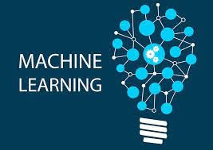

<h1>Hi There! 👋</h1>

## Mauricio Klaus
(Python | AWS | Deep Learning | Data Science | SQL | Android | Java ) 🚀

- 👩‍💻 Software Developer
- 🏆 Proficiency in SQL  
- 🌐 Passionate about technology
- 💡 Love a good challenge
- 🎓 Master's Degree in Computer Science - Artificial Intelligence @ [UNISINOS](https://www.unisinos.br/)

  

  
 

